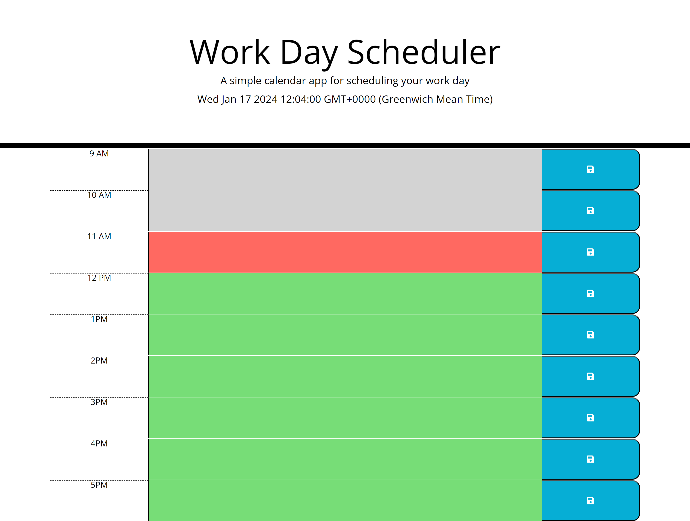

# Daily-Planner-App
## Project Overview
The Daily Planner App is a user-friendly calendar application designed to help individuals manage their daily schedules effectively. This project involves enhancing and modifying the provided starter code using jQuery and the Day.js library for handling date and time functionality.

## User Story
As an employee with a busy schedule, I want to add important events to a daily planner so that I can manage my time effectively.

## Acceptance Criteria

* It is done when the current day is prominently displayed at the top of the calendar when a user opens the planner.

* It is done when timeblocks for standard business hours are presented as the user scrolls down the planner.

* It is done when each timeblock is colour-coded based on whether it is in the past, present, or future when viewed.

* It is done when users can enter an event by clicking on a specific timeblock.

* It is done when the entered event is successfully saved to local storage when the user clicks the save button in the corresponding timeblock.

* It is done when entered events persist between refreshes of the page, ensuring data continuity.

## Webpage Screenshot

## Live Demo
- A live version of the results can be accessed here: 
[Live Link]()

## Technologies Used
* HTML
* CSS
* JavaScript
* Bootstrap
* jQuery

## Credits
* Create Date Object - [Source](https://phoenixnap.com/kb/how-to-get-the-current-date-and-time-javascript)

* CreateElement() Method - [Source](https://www.geeksforgeeks.org/html-dom-createelement-method)

* CreateElement() Method - [Source](https://www.geeksforgeeks.org/html-dom-createelement-method)

* GetElementsByClassName() Method: - [Source](https://www.w3schools.com/jsref/met_document_getelementsbyclassname.asp)

* LocalStorage Object: - [Source](https://developer.mozilla.org/en-US/docs/Web/API/Window/localStorage)

* QuerySelector() Method - [Source](https://www.w3schools.com/jsref/met_element_queryselector.asp#:~:text=The%20querySelector()%20method%20returns,the%20querySelectorAll()%20method%20instead.)